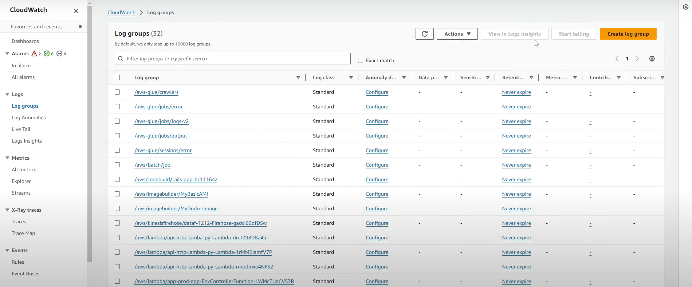
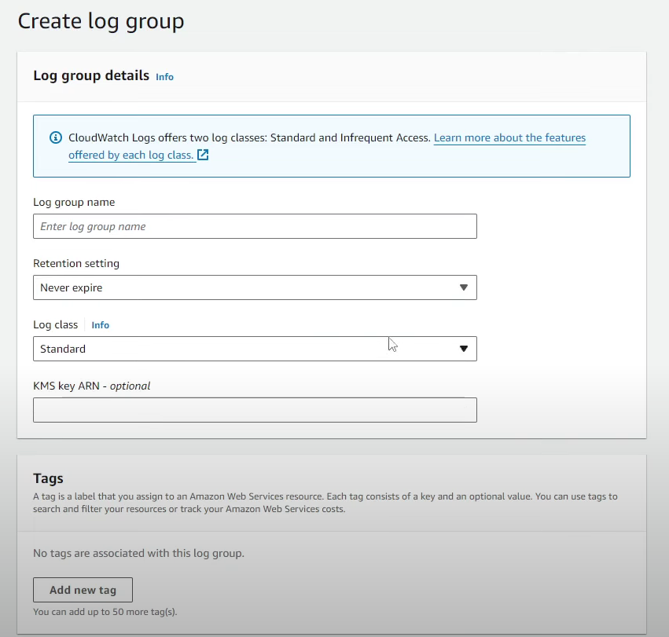

# Create Log Group on CloudWatch

### 1. Create Log Group by Console

1. Search CloudWatch

2. Click Log groups

3. Click Create log group

4. Type log group name

5. Select retention setting

6. Select log class

7. Type KMS key (Opsional)

8. Click create

