## Build a VPC

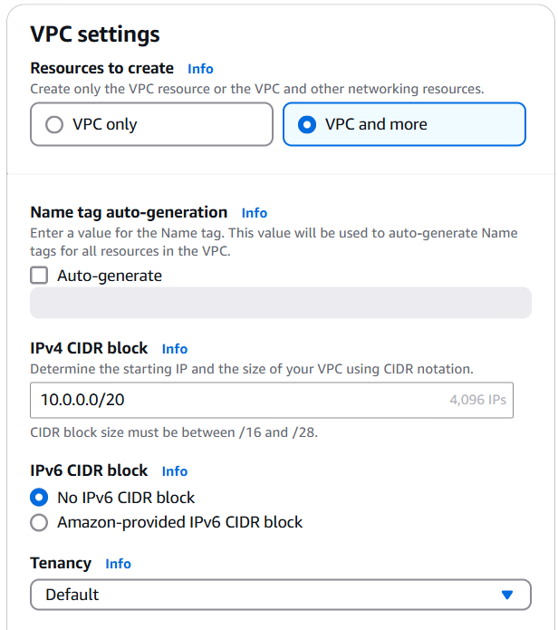

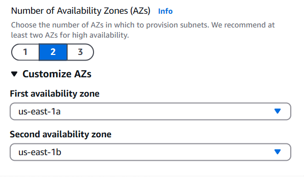

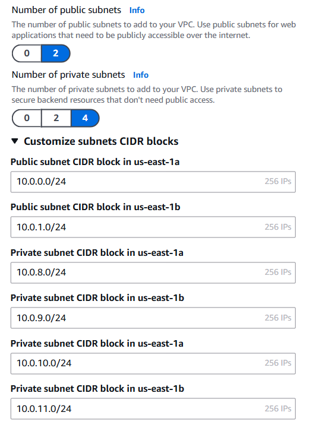

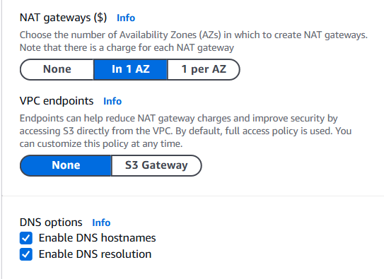

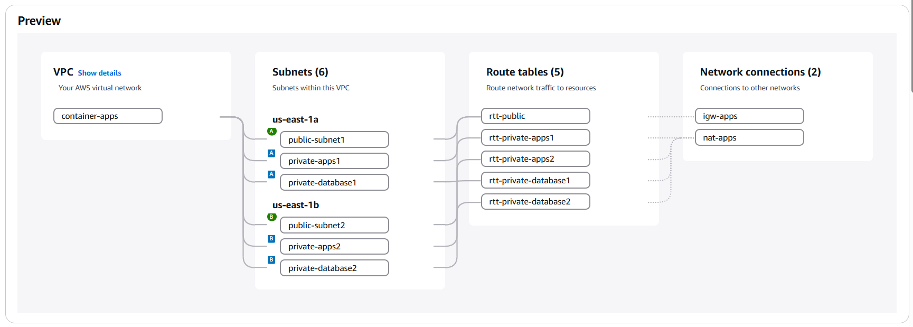

## Create a Security Group

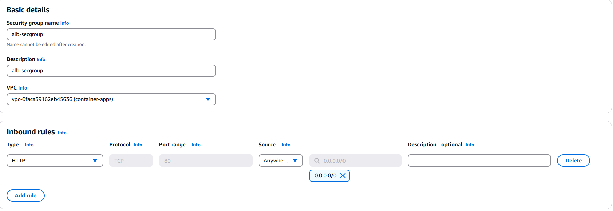

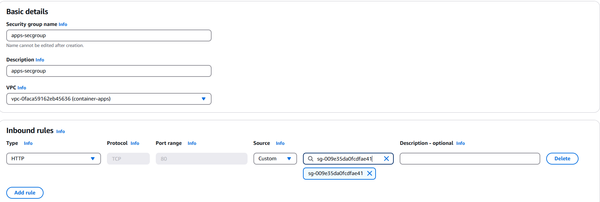

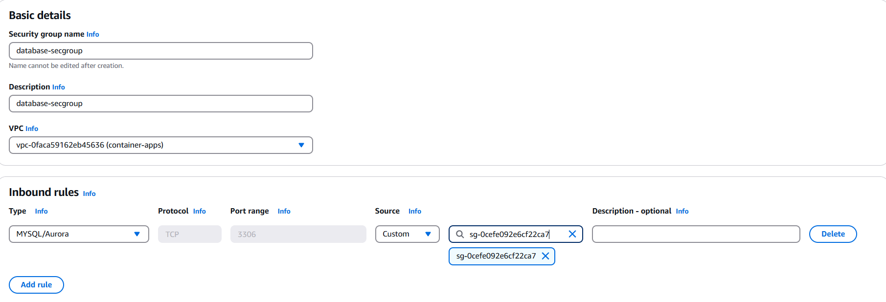

## Create an Amazon ECR Repository

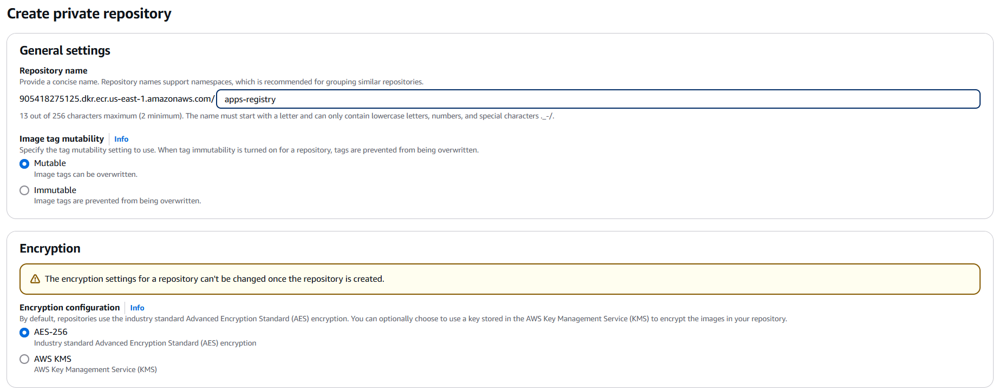

## Create an IAM Role

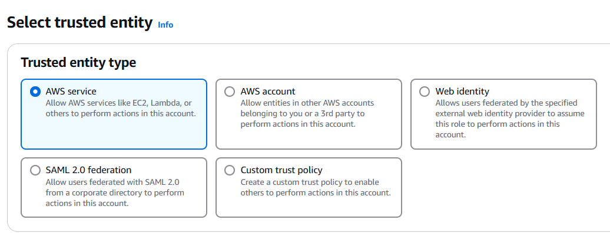

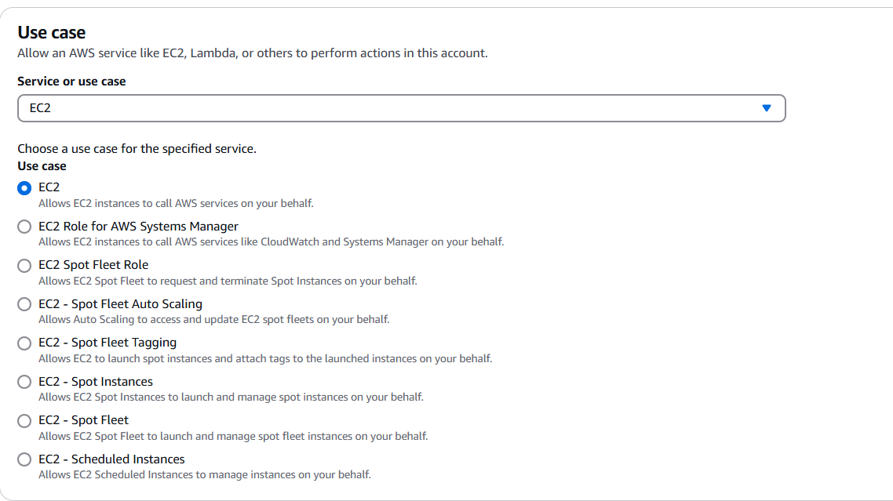

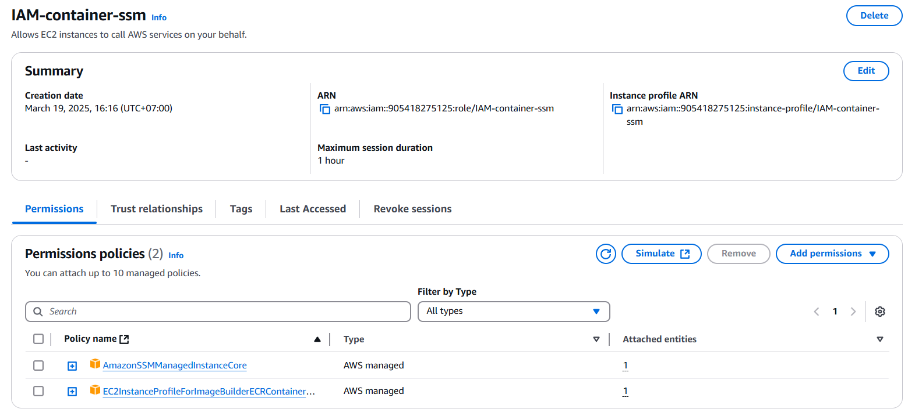

## Create an Instance EC2

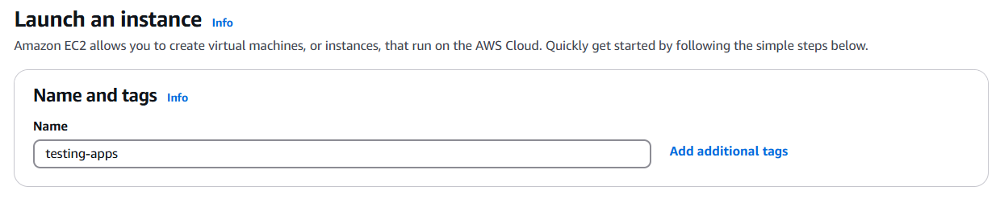

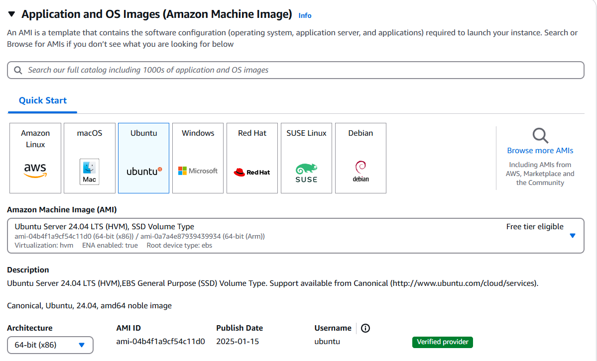

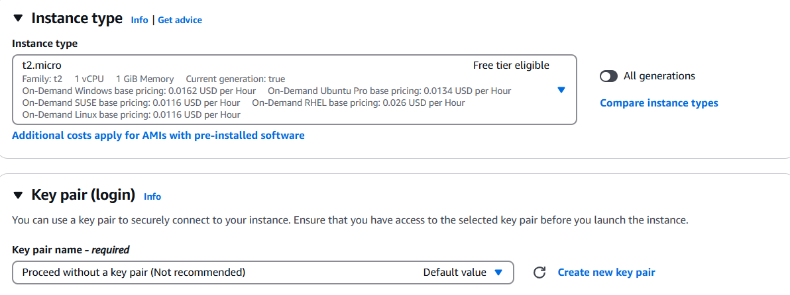

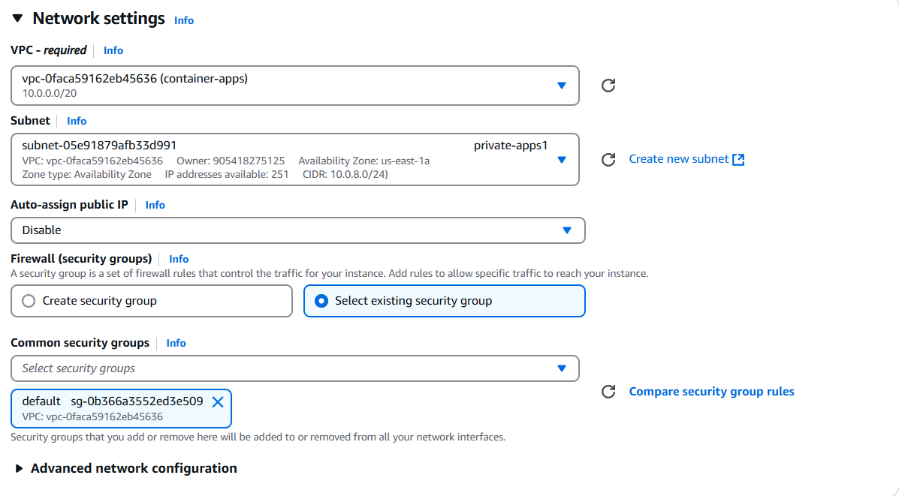

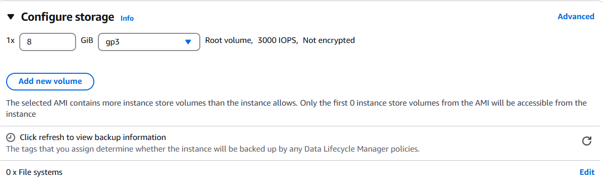

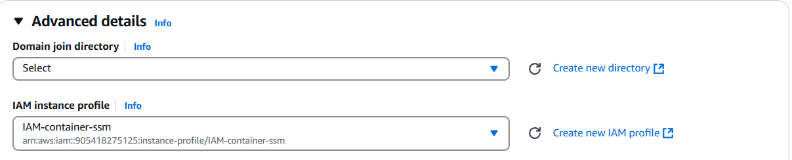

## Connect to instance

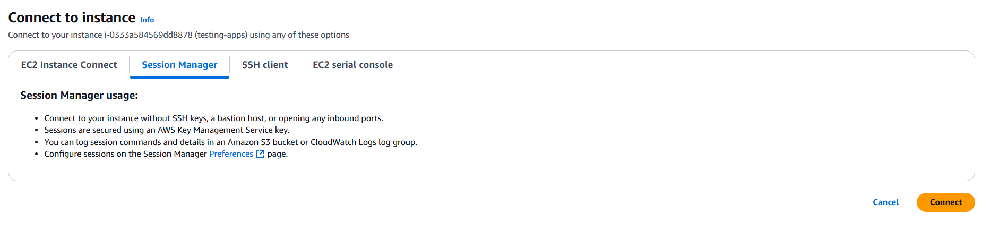

```bash
# Use root user
sudo su

# Add user
adduser [username]

# Add username to the sudo group
sudo usermod -aG sudo [username]

# Verify by switching to [username] and checking
su - danang

# Update package
sudo apt update -y
```

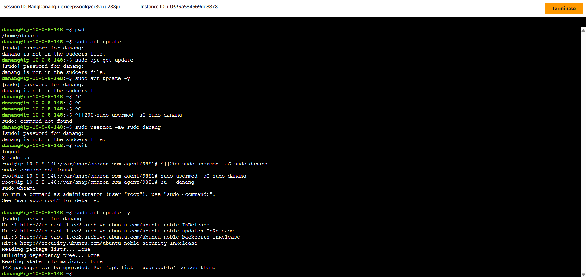

## Install Docker

```bash
# Install a few prerequisite packages which let apt use packages over HTTPS
sudo apt install apt-transport-https ca-certificates curl software-properties-common

# Then add the GPG key for the official Docker repository to your system
curl -fsSL https://download.docker.com/linux/ubuntu/gpg | sudo apt-key add -

# Add the Docker repository to APT sources
sudo add-apt-repository "deb [arch=amd64] https://download.docker.com/linux/ubuntu focal stable"

# Make sure you are about to install from the Docker repo instead of the default Ubuntu repo
apt-cache policy docker-ce

# Finally, install Docker
sudo apt install docker-ce

# Docker should now be installed, the daemon started, and the process enabled to start on boot. Check that it’s running
sudo systemctl status docker
```

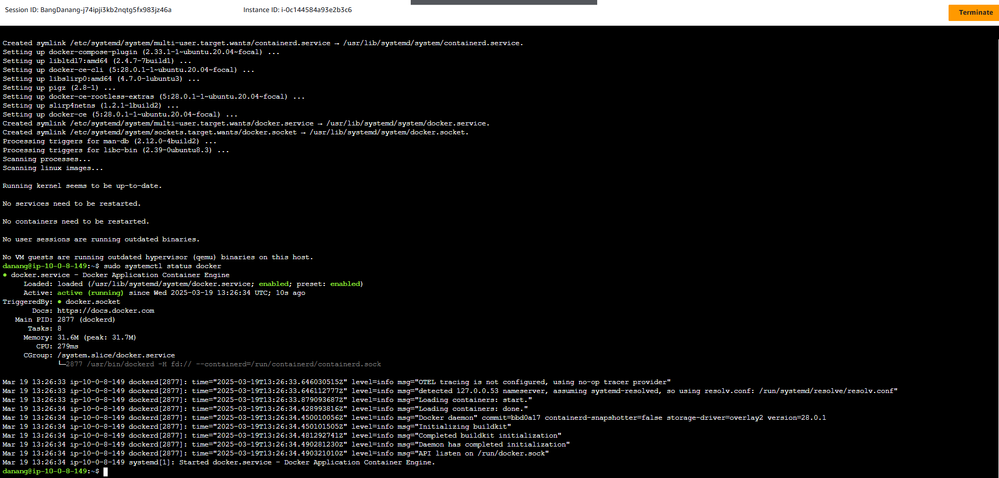

## Import file

```bash
# Import file from github
wget https://github.com/iaasacademy/aws-how-to-guide/raw/238deeefb955ddef46c673f5154754f679410d57/amazon-ecs-mini-project/ritual-roast-code.zip

# Install unzip
sudo apt install unzip

# Unzip file
unzip [file_name]

# change directory
cd [folder_name]
```

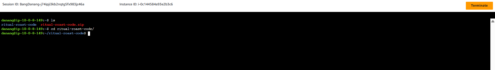

# Build a docker image

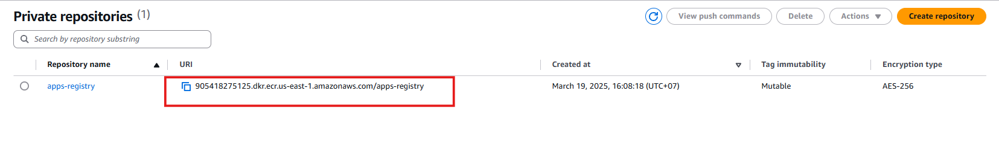

```bash
# Running docker build
sudo docker build -t 905418275125.dkr.ecr.us-east-1.amazonaws.com/apps-registry .
```

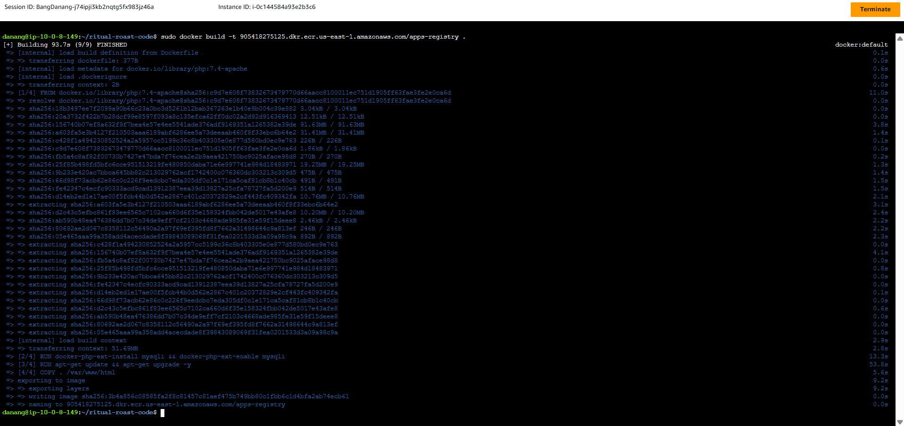
