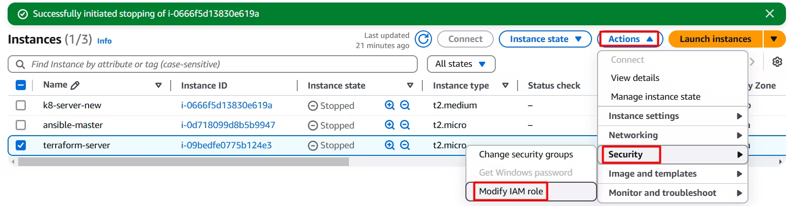

# AWS IAM: Secure AWS Account and Manage Resources

References : [chetan.hashnode.dev](https://devops-concepts-by-chetan.hashnode.dev/aws-iam-a-step-by-step-guide-to-secure-your-aws-account-and-manage-resources)

### A. Root Account

1. Go to the AWS Console, search for IAM, and click on IAM.

Here you can find security recommendations. There are two security concerns:

- Root user has MFA:

  - We can use an MFA Authenticator app on both a laptop and a phone.

- Root user has no active access keys:

  - We can access the account through a password or the CLI. In the CLI, instead of a password, we use tokens and keys. For security reasons, the root user should not have an access key because if it falls into the wrong hands, it could lead to significant issues.

### B. Users

- To follow these security recommendations, we can enable our MFA and remove the access keys.

### C. Identity Providers

- If you want to provide access to your AWS account to JIRA, GitHub, GitLab then you can add them as a Identity Provider.

- You can also grant access to your AWS account to another user's AWS account.

### D. Policies

- It's a written document that details what access users have. For example, if your user has access to create and read EC2 instances then the user can only perform the tasks they have access to in the policy.

- Scenario: If you are an admin and a new employee joins who is a fresher, and you want to grant them read/write access, you need to go to IAM, create a user, and then attach the necessary access to the EC2 instance. So, the user can only access the EC2 instance and change their password upon login, but nothing more.

- Now the user can log in to the console, change their password on the first login, and then create EC2 instances, but they cannot do anything beyond this. This is known as Policy.

### E. Create a user with CLI access

To create a user with access to the Command Line Interface (CLI), follow these steps:

1. Click on "Create a User":

2. Add a username and click "Next." Since console access is not required, you can skip the checkbox for console access.

3. Now you can see multiple options here:

- First, we will examine groups:

  - Here, we can assign group permissions to the user. The permissions that the group has will automatically apply to our user.

- The best approach is to create a group, attach the necessary policies to it, and then add the user to that group. As shown in above image.

- Create a group and add EC2 Instance full access.

- Once group created add any user to that group as shown below:

- Our user has access to the EC2 Instance, but we do not want to grant them direct access to the database. However, since the user is a developer, they need to perform insert and delete operations within the instance.

- To address this, we will assign a Role to our EC2 instance, enabling it to interact with the database. This way, the user does not have direct database access, but they can work on the EC2 instance, which has the necessary Service Roles to interact with the database. Thus, we are granting permission to the EC2 instance to communicate with the database.

- Now click on "Create Role."

- Select "AWS Service" and choose "EC2" in the "Use case" section, then click "Next."

- Select RDS permissions:

- Enter a Role Name and click on Create Role:

To assign the created role to your EC2 instance, follow these steps:

- Navigate to the EC2 Console by searching for "EC2" in the search box, which will redirect you to the EC2 Console.

- Locate your Instance and click on “Actions” and follow the below steps:

